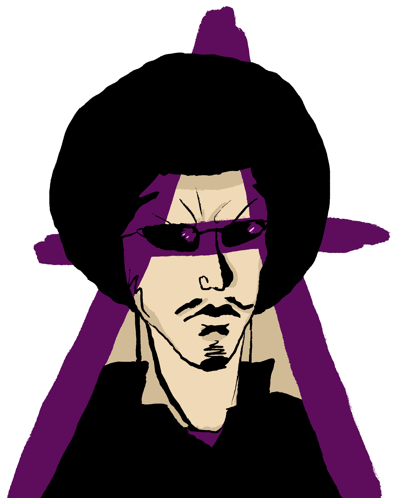
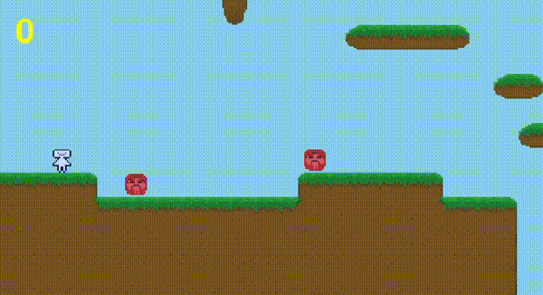
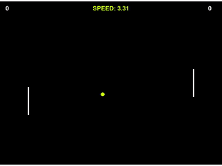
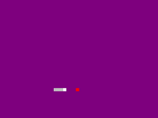
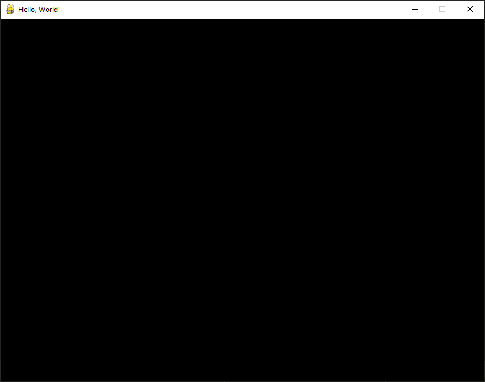

<p align="center">
	
</p>

<h1 align="center">Ajishio</h1>

<p align="center">
	A relaxed, GameMaker-inspired 2D engine built on <a href="https://github.com/pygame-community/pygame-ce">pygame-ce</a>.<br/>
	Designed for rapid prototyping, integrated Python workflows, and portable game development.
</p>

<p align="center">
	<a href="#quick-links">Quick Links</a> •
	<a href="#why-ajishio">Why Ajishio</a> •
	<a href="#quick-start">Quick Start</a> •
	<a href="#demo-showcase">Demo Showcase</a> •
	<a href="#documentation">Documentation</a> •
	<a href="#web-export">Web Export</a> •
	<a href="#roadmap">Roadmap</a>
</p>

<p align="center">
	<a href="https://github.com/tristanbatchler/ajishio/actions/workflows/build_site.yml">
		
	</a>
	
	
	<a href="https://tristanbatchler.github.io/ajishio/docs/">
		
	</a>
	<a href="https://tristanbatchler.github.io/ajishio/docs/demo-projects/">
		
	</a>
</p>

---

## Quick Links

| What | Where |
| --- | --- |
| Public API reference | [docs/api.md](docs/api.md) |
| Docs landing page | [docs/index.md](docs/index.md) |
| Demo list | [docs/demo-projects.md](docs/demo-projects.md) |
| Best single-player example | [demo_projects/platformer/main.py](demo_projects/platformer/main.py) |
| Best networking example | [demo_projects/multiplayerv2/client/main.py](demo_projects/multiplayerv2/client/main.py) |
| Browser export helper | [pygbag_export.py](pygbag_export.py) |
| Contributor workflow | [docs/contributing.md](docs/contributing.md) |

## Why Ajishio

Ajishio aims to recreate the "open a file and start making a game" feeling from classic GameMaker,
but with modern Python ergonomics.

- Familiar object lifecycle with `step()` and `draw()` hooks
- Fast iteration loop for prototypes and game jam ideas
- Room loading with LDtk and sprite workflows via Aseprite exports
- Built-in paths for desktop and browser deployment
- Practical examples in `demo_projects/` that are meant to be copied and hacked

The name "Ajishio" is a reference to
[Noboru Yamaguchi](https://cromartiehigh.fandom.com/wiki/Noboru_Yamaguchi), the greatest comedian 
in all of Japan. There's no other reason.

## Quick Start

### 1) Clone and install

Ajishio uses [uv](https://github.com/astral-sh/uv) for workspace and environment management.

```bash
git clone https://github.com/tristanbatchler/ajishio
cd ajishio
uv sync
```

### 2) Run the hello world demo

```bash
uv run -m demo_projects.hello_world.main
```

<details>
<summary><strong>More demo launch commands</strong></summary>

```bash
uv run -m demo_projects.platformer.main
uv run -m demo_projects.pong.main
uv run -m demo_projects.sokoban.main
uv run -m demo_projects.multiplayerv2.client.main
```

</details>

### 3) Build your own minimal game

```python
import ajishio as aj

aj.room_set_caption("Hello, Ajishio")
aj.room_set_size(640, 360)
aj.game_start()
```

Run from repository root:

```bash
uv run -m your_project.main
```

Try one of the larger examples:

```bash
uv run -m demo_projects.platformer.main
```

> [!IMPORTANT]
> Use `import ajishio as aj` in your game code. The top-level `ajishio` namespace is the intended public API facade.

## Demo Showcase

Ajishio ships with multiple complete demos for platformers, puzzle games, arcade clones, and
event a multiplayer example.

<p align="center">
	
	
</p>

<p align="center">
	
	
</p>

- Run any demo locally:

```bash
uv run -m demo_projects.sokoban.main
```

- Play browser versions instantly:
	[Web Demos](https://tristanbatchler.github.io/ajishio/docs/demo-projects/)

## Documentation

- Full docs: [tristanbatchler.github.io/ajishio/docs](https://tristanbatchler.github.io/ajishio/docs/)
- API overview: [docs/api.md](docs/api.md)
- Rooms and LDtk loading: [docs/rooms.md](docs/rooms.md)
- Sprites and animation pipeline: [docs/sprites.md](docs/sprites.md)
- Networking docs: [docs/net/index.md](docs/net/index.md)
- VS Code workflow tips: [docs/vs-code.md](docs/vs-code.md)
- Profiling guide: [docs/profiling.md](docs/profiling.md)

## Web Export

Export any demo to a playable browser build with pygbag:

```bash
uv run pygbag_export.py demo_projects/platformer
```

The build artifacts are generated under the demo's `_web_build/` directory.

<details>
<summary><strong>Build-only mode (skip local server)</strong></summary>

```bash
uv run pygbag_export.py demo_projects/platformer --build
```

</details>

## Project Layout

```text
ajishio/
├── ajishio/src/ajishio/      # Engine package
├── demo_projects/            # Runnable demos and examples
├── docs/                     # Documentation source (MkDocs)
├── site/                     # Generated static docs
└── pygbag_export.py          # Web export helper
```

## Roadmap

- [x] Load rooms from files (LDtk)
- [x] Support multiple rooms per game
- [x] Load and animate sprites (Aseprite export workflow)
- [x] Load and play sound/music
- [x] Support persistent objects
- [x] Profiling workflow docs and support
- [x] API docs generation via MkDocs
- [x] Browser export via pygbag
- [x] Faster collision checks using a spatial quadtree

## Contributing

Contributions are welcome. For development and documentation workflow details, start with
[docs/contributing.md](docs/contributing.md).