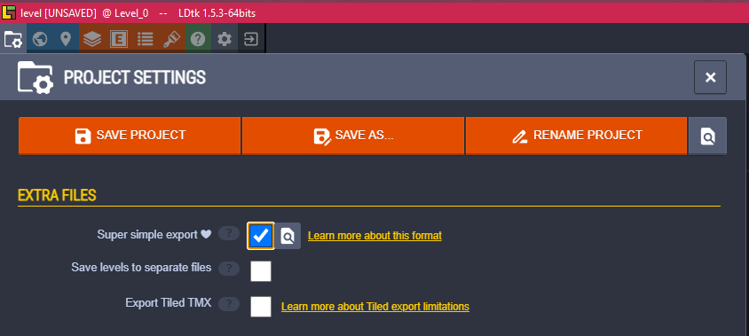

# Loading Rooms

Currently, Ajishio only supports loading rooms in [LDtk](https://ldtk.io) format. First download
the LDtk editor from the website, and create your room (there are some good tutorials out there on
how to do this). Once you have your room, make sure to enable the **Super simple export** option in
the Project Settings tab. This will export the room as a set of files in a folder that Ajishio can
load directly.

> **Tip:** Save your LDtk project directly in your project directory so you can re-export without
> copying files manually.

Copy the `simplified/` folder generated by LDtk into your project directory. Then load it with
`aj.load_ldtk_levels`, passing the path to `simplified/` as the argument. It returns a list of
`aj.GameLevel` objects to pass to `aj.set_rooms`.

In order for the engine to instantiate your tiles and entities, define classes with the **same name
as they appear in LDtk** and register them with `aj.register_objects` before calling
`aj.game_start`.

See the [`platformer`](https://github.com/tristanbatchler/ajishio/blob/main/demo_projects/platformer/__main__.py)
demo project for a full example.
