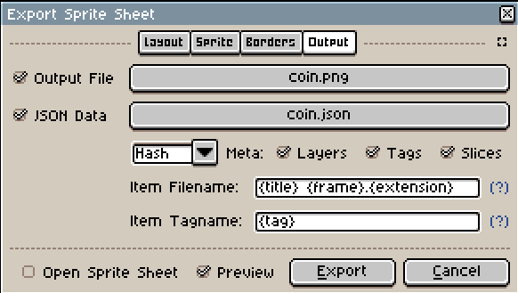

# Sprites & Collision

## Loading Sprites

Ajishio supports loading sprites from [Aseprite](https://www.aseprite.org) files. Create your
(animated) sprite in Aseprite and export it as both a `.png` sprite sheet and a `.json` data file,
both into the same directory in your project.



Load sprites with `aj.load_aseprite_sprites`, passing the directory path. It returns a
`dict[str, aj.GameSprite]` keyed by the sprite name you saved in Aseprite:

```python
class Player(aj.PhysicsObject):
    def __init__(self, x: float = 0, y: float = 0, **kwargs: Unpack[aj.GameObjectKwargs]) -> None:
        super().__init__(x, y, **kwargs)
        self.sprite_index = sprites['player']
        self.image_speed = 10
```

Ajishio automatically animates the sprite at `image_speed` frames per second. Make sure to call
`super().step()` and `super().draw()` in any overridden `step`/`draw` methods.

See the [`platformer`](https://github.com/tristanbatchler/ajishio/blob/main/demo_projects/platformer/__main__.py)
demo for a full example.

## Collision Masks

Only rectangular collision masks are currently supported. Set the `collision_mask` attribute in the
constructor, typically using `sprite_width` and `sprite_height` as a starting point:

```python
class Player(aj.GameObject):
    def __init__(self, x: float = 0, y: float = 0, **kwargs: Unpack[aj.GameObjectKwargs]) -> None:
        super().__init__(x, y, **kwargs)
        self.sprite_index = sprites['player']
        self.collision_mask = aj.CollisionMask(
            bbtop=3, bbleft=3, bbright=self.sprite_width - 3, bbbottom=self.sprite_height
        )
```

Bounding box coordinates are relative to the top-left corner of the sprite.
