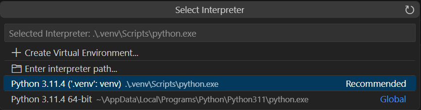
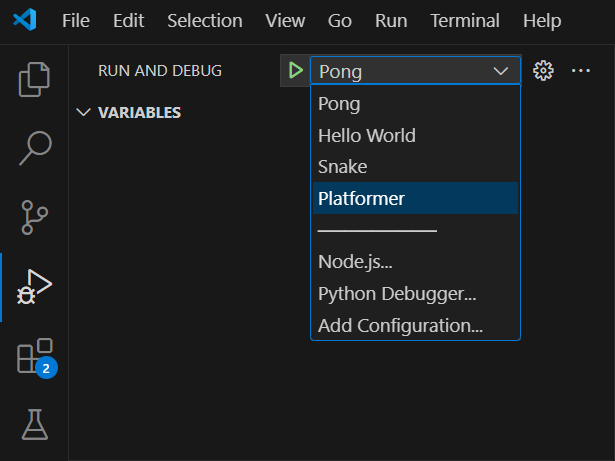

# VS Code Integration

It is recommended to install the
[Python extension](https://marketplace.visualstudio.com/items?itemName=ms-python.python) before
editing your game in VS Code. Once it is installed, ensure that the Python interpreter is set to the
one in the virtual environment you created earlier. You can do this by opening the command palette
(`Ctrl+Shift+P`) and typing `Python: Select Interpreter` and choose `./.venv/bin/python` or
`./.venv/Scripts/python.exe` on Windows.



## Debugging with F5

You can set up a launch task to debug your game with F5. Add an entry to the
`.vscode/launch.json` file's `"configurations"` array:

```json
{
    "name": "<your project name>",
    "type": "debugpy",
    "request": "launch",
    "module": "<your.dot.separated.project.directory>"
}
```

For example, if your game script is at
`my_stuff/games/ziltoid_the_destroyer/__main__.py`, your `launch.json` should look like:

```json
{
    "version": "0.2.0",
    "configurations": [
        {
            "name": "Ziltoid the Destroyer",
            "type": "debugpy",
            "request": "launch",
            "module": "my_stuff.games.ziltoid_the_destroyer"
        }
    ]
}
```

Go to the debug tab (`Ctrl+Shift+D`), select your project from the dropdown, and press F5.



## Static Analysis

Ajishio is fully typed and works well with
[basedpyright](https://github.com/DetachHead/basedpyright) and
[ruff](https://github.com/astral-sh/ruff). Install the corresponding VS Code extensions to get
real-time type checking and linting.

### Runtime globals and typing

All public API — functions, classes, constants, and live engine/view state — is available directly
on the `ajishio` package via a single `import ajishio as aj`. Callables, data classes, and
constants are module-level names resolved at import time. Live per-frame values such as
`aj.room_width`, `aj.delta_time`, `aj.room_speed`, `aj.view_current`, `aj.window_width`, and
`aj.room_background_color` are resolved dynamically via `__getattr__` so they always reflect the
current engine state. View port dictionaries (`aj.view_xport`, `aj.view_yport`, `aj.view_wport`,
`aj.view_hport`) are exported as direct references to the live mutable dicts on the `View`
singleton, so reads and writes to them are always live.
